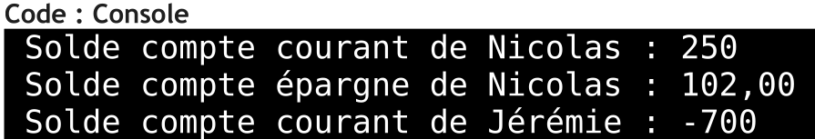

# tp-banque
Remake du tp banque (que les SLAM on eu durant le BTS)

# Détails du TP

- Langage utilisé : Java

# Énoncé (Première partie)

Notre mini application devra pouvoirs géré les soldes bancaires de plusieurs clients, pour ce faire, toutes données manipuler sront sous forme décimals.

Un compte bancaire est composer de : 

- D'un solde (calculé mais pas modifiable)
- D'un propriétaire (nom du propriétaire du compte)
- D'une liste d'opération interne permettant de garder l'histoire du compte, non accésible par les autres obejts
- D'une méthode permettant de Créditer() le compte, prenant une somme et un compte en paramètre, créditant le compte et débitant le compte passé en paramètres.
- D'une méthode permettant de debiter() le compte, prenant une somme et un compte bancaire en paramètre, débitant le compte et créditant le compte passer en paramètre
- D'une méthode qui permet d'afficher le résumer d'un compte 

Un compte courant est composé de : 

- Tout ce qui est un compte
- D'un découvert autoriser non modificable défini à l'ouverture du compte
- Le résumer d'un compte courant affiche le solde, le propriétaire, le découvert autoriser ainsi que les opérations sur le compte

Un compte épargne entreprise est une sorte de compte et est composé : 

- De tout ce qui compose un compte
- D'un taux d'abondement définis à l'ouverture du compte en fonction de l'ancienneté du salarié, un taux est un double compris entre 0 et 1 (ex. 5% = 0.05)

**Attention** : 
Le solde doit tenir compte du taux d’abondement, mais l’abondement n’est pas calculé lors des
transactions car l’entreprise verse l’abondement quand elle le souhaite ; le résumé d’un compte
épargne entreprise affiche le solde, le propriétaire, le taux d’abondement ainsi que les opérations
sur le compte.

Une opération bancaire est composée : 
- D'un montant 
- D'un type de mouvement, crédit ou débit

Créer l'application avec les informations suivantes : 

- Le compte courant de nicolas à un découvert autoriser de 2000€
- Le compte épargne entreprise de nicolas à un taux de 2%
- Le compte courant de Jérémie à un découvert autoriser de 500€
- Nicolas touche son salaire de 100€
- Il fait le plein de sa voiture (50€)
- Il met de coté sur son compte épargne entreprise la coquette somme de 20€
- Puis il reçoit un cadeau de la banque de 100€ car il à ouvert sont compte pendant la période
- Il remet 20€ sur sont compte bancaire car finalement il ne se sant pas méga en sécurité
- Jérémie achète un nouveau PC : 500€
- Puis il rembourse ses dettes à nicolas : 200€

Ensuite nous afficherons le résumer du compte courant de nicolas et de sont compte épargne entreprise, ce qui nous donnera : 

